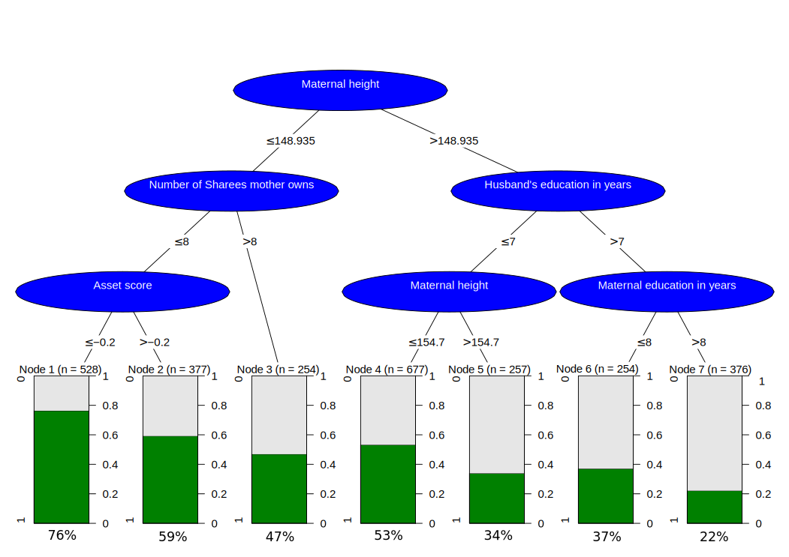

```{r setup, include=FALSE}
knitr::opts_chunk$set(echo = TRUE)
```

# Assignment 1

```{r pressure, echo=FALSE, fig.cap="Tree", out.width = '100%'}

``` 
 

Imporving tree.pdf file using Inkscape resulted in the following tree which is much better to view and is of publication quality SVG file.

# Assignment 2

## 1

```{r}
senic <- read.table(file="SENIC.txt")
```
 
## 2

```{r}
col_Names <- c("ID", "Length of Stay", "Age", "Infection risk",
               "Routine Culturing Ratio", "Routine Chest X-ray Ratio", "Number of Beds",
               "Medical School Affiliation", "Region","Average Daily Census",
               "Number of Nurses", "Available Facilities & Services")

colnames(senic) <- col_Names

fun_quantile <- function(X){
  Q1 <- unname(quantile(X, 0.25))
  Q3 <- unname(quantile(X, 0.75))
  greater <- Q3 + 1.5*(Q3 - Q1)
  less <- Q1 - 1.5*(Q3 - Q1) 
  index <- senic[(which(X > greater | X < less)),]$ID
  return(index)
}
```


## 3

```{r, warning = FALSE}
library(ggplot2)

Inf_risk <- fun_quantile(senic$`Infection risk`)
value_Inf <- senic[Inf_risk,]$`Infection risk`
# 7.7 1.3 7.6 7.8 1.3 1.4
df_Infrisk <- as.data.frame(value_Inf)

Plot_1 <- ggplot() +
  geom_density(data = senic,aes(x=senic$`Infection risk`), size=1) +
  labs(x="Infection risk", y="Density") +
  geom_point(data = df_Infrisk, aes(x=value_Inf,y = 0, pch=3),size=3,shape=23,colour="red",fill="blue")
Plot_1
```

In the density graph of Infection risk the six outliers are plotted on the X-axis as diamond symbols. 
Outliers: 7.7   1.3   7.6   7.8   1.3   1.4
Majority of the values seem to lie in the region between 4 and 5.

## 4

```{r}
library(gridExtra)
combined_plots <- lapply(c(2:7,10,11), function(i){
  ggplot() +
    geom_density(aes(senic[,i])) +
    geom_point(aes(x = senic[fun_quantile(senic[,i]),i], y = 0), shape = 23, col = "red", fill = "red") +
    labs(x = col_Names[i])
})

Plot_Final <- arrangeGrob(grobs = combined_plots, nrow=2)
plot(Plot_Final)
```

The density plots for all quantitative variables are plotted in a similar manner. The outliers are again plotted on the X-axis in Diamond symbols.
The outliers for Density graph of Length of stay, Routine cultring ratio, Routine chest x-ray ratio, Number of beds, Average daiy census and Number of nurses seem to lie only in the right portion of the graph.
The outliers for Density graph of Infection risk, Age, seem to lie on either sides of the graph.
There are no outliers in the variable Available Facilities and services.
The Density graph for Length of stay, Routine Culturing ratio, Number of beds, Average daily census, Number of nurses is right scewed.

## 5

```{r}
ggplot(data = senic, aes(x = senic$`Number of Nurses`, y = senic$`Infection risk`,
                         color = senic$`Number of Beds`))+
  labs(x="Number of Nurses", y="Infection risk", colour="Number of Beds")+
  geom_point()+
  theme_light()
```
As the plot includes 3 variables Infection risk, Number of nurses and Number of beds we can see the dependence of these variables on each other which was not available in the density graph for each of these variables.
The Infection risk seem to increase with the increase in the number of beds while the Number of Nurses stay almost constant.But when there is an increase in the Number of nurses along with the increase in Numer of beds the Infection risk reduces signifcantly. The Infetion risk is lowestwhen both Number of beds and nurses is low.
Danger- The minute difference in colour saturation cannot be easily distinguished. If any ouliers exist, they cannot be differentiated easily compared to when distinct colours are used. 

## 6  

```{r, warning = FALSE}
library(plotly)
library(later)
ggplotly(Plot_1)
```
We get an interactive graph wherein the cursor can be hovered on the plot to get info such as the x-axis and y-axis variable values at any particular point on the plot. The value of outliers can easily be found out by just hovering the cursor on the outliers. The approximate value of mean can be checked instantly.
 
## 7

```{r, warning = FALSE}
library(dplyr)
riskIndex <- fun_quantile(senic$`Infection risk`)
outliersRisk <- senic[riskIndex,]

plt <- senic %>% select('Infection risk') %>%
  mutate(Rank=ntile(senic$`Infection risk`,3)) %>%
  plot_ly(x=senic$`Infection risk`, type = "histogram",
          histnorm = "probability",
                name = "Density of Data") %>%
  add_markers(x = outliersRisk$'Infection risk' , y = 0,
              marker = list(size =10 ,symbol = 23,color = "red"),
              name = "Outliers") %>%
  layout(title = "Histogram of Infection Risk with Outliers",
         xaxis = list(title = "Infection Risk"), 
         yaxis = list(title = "Density"))
plt
```

## 8

```{r, eval=FALSE}  
senic <- read.table("SENIC.txt")

colnames(senic) <- c("ID","STAY","AGE","RISK","CULTURE_RATIO","CHEST","BEDS","AFFILIATION","REGION","CENSUS","NURSES","FS")

fun_quantile <- function(X){
  Q1 <- unname(quantile(X, 0.25))
  Q3 <- unname(quantile(X, 0.75))
  greater <- Q3 + 1.5*(Q3 - Q1)
  less <- Q1 - 1.5*(Q3 - Q1) 
  index <- senic[(which(X > greater | X < less)),]$ID
  return(index)
}

Select_Variables <- c("STAY","AGE","RISK","CULTURE_RATIO","CHEST","BEDS","CENSUS","NURSES","FS")

ui <- fluidPage(
  sliderInput(inputId="bw_value", label="Choose bandwidth size", value=0.1, min=0.01, max=1),
  checkboxGroupInput("var", "Variables ", Select_Variables , inline=TRUE,selected = "STAY"),
  plotOutput("densPlot")
)

server <- function(input, output) { 
  output$densPlot <- renderPlot({ 
    sele <- input$var
    lst <- vector("list" , length = length(sele))
    
    for (i  in 1:length(sele)) {
      vals <- fun_quantile(senic[,sele[i]])
      senic2 <- senic[vals,]
      lst[[i]] <- ggplot() + geom_density(data = senic, aes_string(x = sele[i] ), size=1,bw = input$bw_value) +
        geom_point(data=senic2, aes_string(x = sele[i],y=0, pch=3),size=3,shape=23,colour="red",fill="blue") + 
       scale_shape_identity()
    }
    final <- arrangeGrob(grobs = lst)
    grid.arrange(final)
  })
}

shinyApp(ui = ui, server = server) 
```

The plot seems to get cluttered at low bandwidth and we can view every point in the graph which is not the proper way to see density of a variable. When we increase the bandwidth the graph becomes more smooth and shows us general view of the variable. The chosen bandwidth is 0.01 to 1 with increase of 0.01. By analyzing the graph we found at 0.38 bandwidth the graph shows the best view of data density.