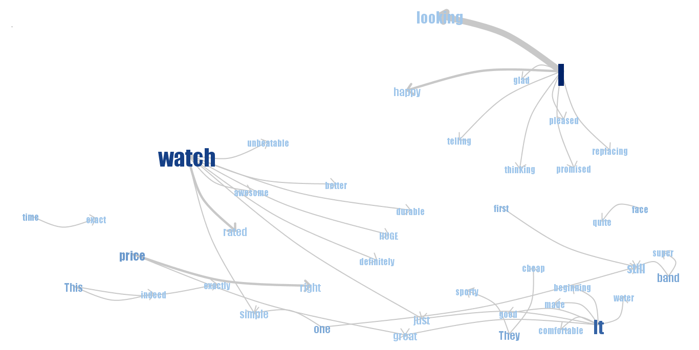

# Assignment 1

## 1.1

```{r message=FALSE, warning=FALSE}

library(tm)
library(wordcloud)
library(RColorBrewer)

data_1<-read.table("Five.txt",header=F, sep='\n') #Read file
data_1$doc_id=1:nrow(data_1)
colnames(data_1)[1]<-"text"

#Here we interpret each line in the document as separate document
mycorpus_1 <- Corpus(DataframeSource(data_1)) #Creating corpus (collection of text data_1)
mycorpus_1 <- tm_map(mycorpus_1, removePunctuation)
mycorpus_1 <- tm_map(mycorpus_1, function(x) removeWords(x, stopwords("english")))
tdm_1 <- TermDocumentMatrix(mycorpus_1) #Creating term-document matrix
m_1 <- as.matrix(tdm_1)

#here we merge all rows
v_1 <- sort(rowSums(m_1),decreasing=TRUE) #Sum up the frequencies of each word
d_1 <- data.frame(word = names(v_1),freq=v_1) #Create one column=names, second=frequences
pal_1 <- brewer.pal(6,"Dark2")
pal_1 <- pal_1[-(1:2)] #Create palette of colors
wordcloud(d_1$word,d_1$freq, scale=c(8,.3),min.freq=2,max.words=100, random.order=F, rot.per=.15, colors=pal_1, vfont=c("sans serif","plain"))

data_2<-read.table("OneTwo.txt",header=F, sep='\n') #Read file
data_2$doc_id=1:nrow(data_2)
colnames(data_2)[1]<-"text"

#Here we interpret each line in the document as separate document
mycorpus_2 <- Corpus(DataframeSource(data_2)) #Creating corpus (collection of text data_1)
mycorpus_2 <- tm_map(mycorpus_2, removePunctuation)
mycorpus_2 <- tm_map(mycorpus_2, function(x) removeWords(x, stopwords("english")))
tdm_2 <- TermDocumentMatrix(mycorpus_2) #Creating term-document matrix
m_2 <- as.matrix(tdm_2)

#here we merge all rows
v_2 <- sort(rowSums(m_2),decreasing=TRUE) #Sum up the frequencies of each word
d_2 <- data.frame(word = names(v_2),freq=v_2) #Create one column=names, second=frequences
pal_2 <- brewer.pal(6,"Dark2")
pal_2 <- pal_2[-(1:2)] #Create palette of colors
wordcloud(d_2$word,d_2$freq, scale=c(8,.3),min.freq=2,max.words=100, random.order=F, rot.per=.15, colors=pal_2, vfont=c("sans serif","plain"))

```

First wordcloud corresponds to feedbacks of people who are pleased with the product.
We can see that certain words are bigger than others which means they appear more number of times than other words in the wordcloud.By looking at the words we can get an idea about what features or aspects of the watch which pleased the customers. Here we see that the following features of the watch were found to be good by the customers-Face,looks,price,band,dial. 
We can also guess the features of the watch by looking at the words like dual,digital,analog,alarm,appearence,quality,water resistant,stopwatch,durability etc.
Second wordcloud corresponds to feedbacks of people who are not pleased with the product.
Here we see that the following features of the watch were found to be bad by the customers-Analog,battery,replacement.

## 1.2




### Properties of this watch that are often mentioned

  Appearence- Black, Gold and White face

  Quality

  cost

  Display features- Analog and Digital display

  Luminousity

### Satisified customers are talking about

  Good appearence

  Simple and sporty look

  Durability

  Cheap pricing

  Comfortable to wear

  Durable watch band

  Availability of different types of bands like Velcro band and metal band

  Water resistant

  Easy to read face

  Toughness of the watch

### Unsatisified customers are talking about

  Low luminosity

  Defective alarm

  Buttons get broken and defective easily

  Chronometer does not work properly

  Low alarm sound

  Analog display is defective

  Tough to get the defective product replaced

  Bad at keeping accurate time

  Doesnt work when immersed deep in water

### Good and Bad properties

#### Good properties

    Appearence due to face and size

    Cheap

    Water resistant

    Sporty look

    Tough

    Durable

#### Bad properties

    Luminousity

    Alarm

    Bad quality buttons

    Accuracy of time of Analog display

    Replacement

### Characteristics of the watch

  Display- Digital and analog display

  Luminous display

  Face- Black,Gold or White

  Water resitant

  Sporty look

  Velcro nylon or metal band

  Chronometer
  
  
  
  
# Assignment 2

```{r message=FALSE, warning=FALSE}

library(plotly)
library(crosstalk)
library(tidyr)
library(ggplot2)
library(GGally)

olive <- read.csv("olive.csv")
d <- SharedData$new(olive)

```

## 2.1

```{r message=FALSE, warning=FALSE}

scatterOlive <- plot_ly(d, x = ~linoleic, y = ~eicosenoic) %>%
  add_markers(color = I("black")) %>%
  layout(xaxis=list(title="Linoleic"), yaxis=list(title="Eicosenoic"))
scatterOlive

```

The values at the bottom of the plot have Eicosenoic values between one and three. There are 249 data points in the bottom part of the plot.

## 2.2

```{r message=FALSE, warning=FALSE}

barOlive <- plot_ly(d, x=~as.factor(Region)) %>% add_histogram() %>% 
  layout(barmode="overlay",xaxis=list(title="Region"))

bscols(widths=c(2, NA),filter_slider("stearic", "values of stearic", d, ~stearic)
       ,subplot(scatterOlive,barOlive,titleY = TRUE,  titleX = TRUE)%>%
         highlight(on="plotly_select", dynamic=T, persistent = T, opacityDim = I(1))%>%hide_legend())
```


All the observations which have eicosenoic values less then three are from the region two and three. Region two have linoleic value above 1050 and region three have below 1050.By using the slider it is found that most of the data in region 2 and 3 is between stearic values 180 to 280.We are using three interaction operators i.e. filtering operator for filtering stearic values, selection operator to select low values of Eicosenoic and connection operator to link the above plots together.

## 2.3

```{r message=FALSE, warning=FALSE}

scatterOlive_2 <- plot_ly(d, x = ~linoleic, y = ~arachidic) %>%
  add_markers(color = I("black")) %>%
  layout(xaxis=list(title="Linoleic"), yaxis=list(title="Arachidic"))

subplot(scatterOlive,scatterOlive_2,  titleY = TRUE,  titleX = TRUE)%>%
  highlight(on="plotly_select", dynamic=T, persistent = T, opacityDim = I(1))%>%hide_legend()

```


The Arachidic values which are less then 40 and less then 1050 on Linoleic scale are also at the bottom of the Eicosenoic VS Linoleic plot which are the outliers and they are grouped. Also two points which are greater then 1400 in Linoleic scale are also outliers in both plots which are not grouped.

## 2.4

```{r message=FALSE, warning=FALSE}

p<-ggparcoord(olive, columns = c(4:11))
d<-plotly_data(ggplotly(p))%>%group_by(.ID)
d1<-SharedData$new(d, ~.ID, group="olive")
p1<-plot_ly(d1, x=~variable, y=~value)%>%add_lines(line=list(width=0.3))%>%
  add_markers(marker=list(size=0.3),text=~.ID, hoverinfo="text")

olive2=olive
olive2$.ID=1:nrow(olive)
d2<-SharedData$new(olive2, ~.ID, group="olive")
p2<-plot_ly(d2, x=~factor(Region) )%>%add_histogram()%>%layout(title = "Region",barmode="overlay")

ButtonsX=list()
for (i in 4:11){
  ButtonsX[[i-3]]= list(method = "restyle",
                        args = list( "x", list(olive[[i]])),
                        label = colnames(olive)[i])
}
ButtonsY=list()
for (i in 4:11){
  ButtonsY[[i-3]]= list(method = "restyle",
                        args = list( "y", list(olive[[i]])),
                        label = colnames(olive)[i])
}
ButtonsZ=list()
for (i in 4:11){
  ButtonsZ[[i-3]]= list(method = "restyle",
                        args = list( "z", list(olive[[i]])),
                        label = colnames(olive)[i])
}


p3 <- plot_ly(d2, x=~palmitic, y=~stearic, z=~oleic, alpha = 0.8) %>%
  add_markers() %>%
  layout(xaxis=list(title=""), yaxis=list(title=""), zaxis=list(title=""),
         title = "Select variable:",
         updatemenus = list(
           list(y=1.00, buttons = ButtonsX),
           list(y=0.85, buttons = ButtonsY),
           list(y=0.70, buttons = ButtonsZ)
         )  )

bscols(p1%>%highlight(on="plotly_select", dynamic=T, persistent = T, opacityDim = I(1))%>%
         hide_legend(),
       p3%>%highlight(on="plotly_click", dynamic=T, persistent = T)%>%hide_legend(),
       p2%>%highlight(on="plotly_click", dynamic=T, persistent = T)%>%hide_legend())

```


After brushing the different regions in the bar plot with different colours it was evident that region 1 can be defined using eicosenoic values.
Linoliec values can be used to differentiate between region 2 and 3. All the linoliec values of region 2 are higher than that of region 3. Oleic values servers the same purpose.
So these 3 variables can be used to define a region and can be considered influential variables.
After brusing the different regions in diferent colours finding clusters in the parallel co-ordinate plot beacame easier. There are 2 clusters in region 2 that can be seen when variable linoliec is observed.
By selecting the influential variables in the dropboxes it can be seen that infact each region corresponds to one cluster.

 

## 2.5

The interaction operators used in the above plot are:

Selection 

Connection

Navigation

*Filtering operators* can be used by providing drop boxes for parallel co-ordinate plot like in the case of 3d scatter plot also it will help user to select a range of data. Filtering can be a good strategy to enable user to select values for identification of regions. 
